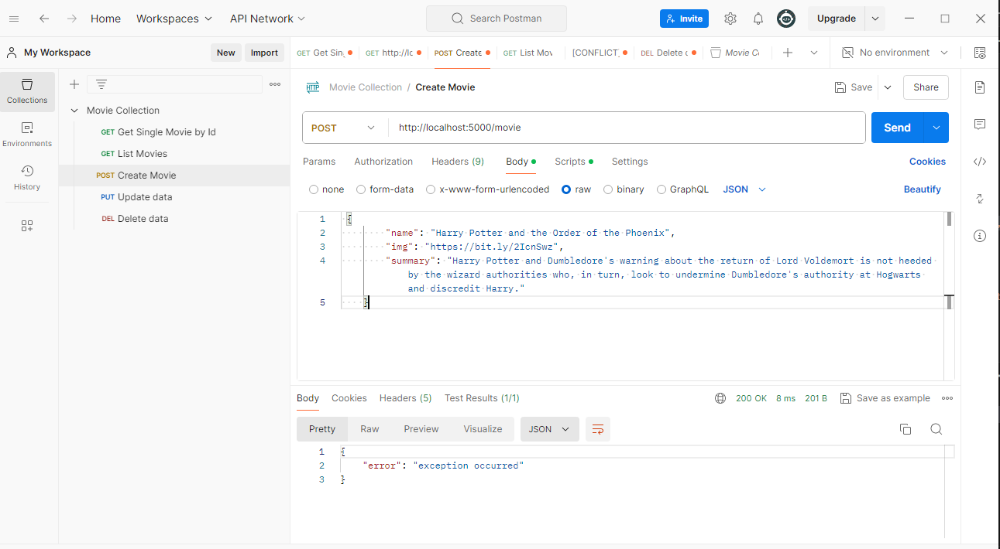
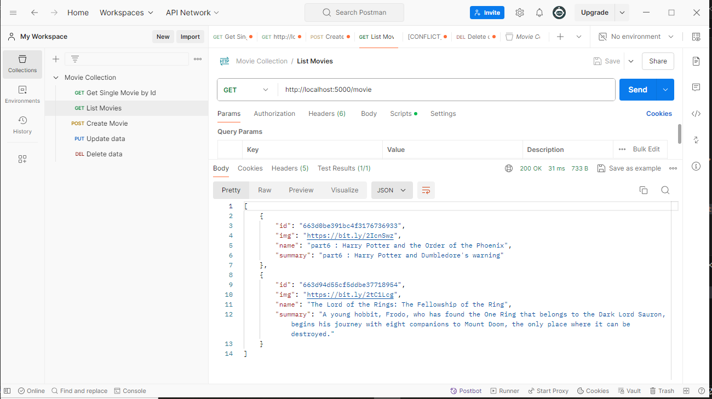
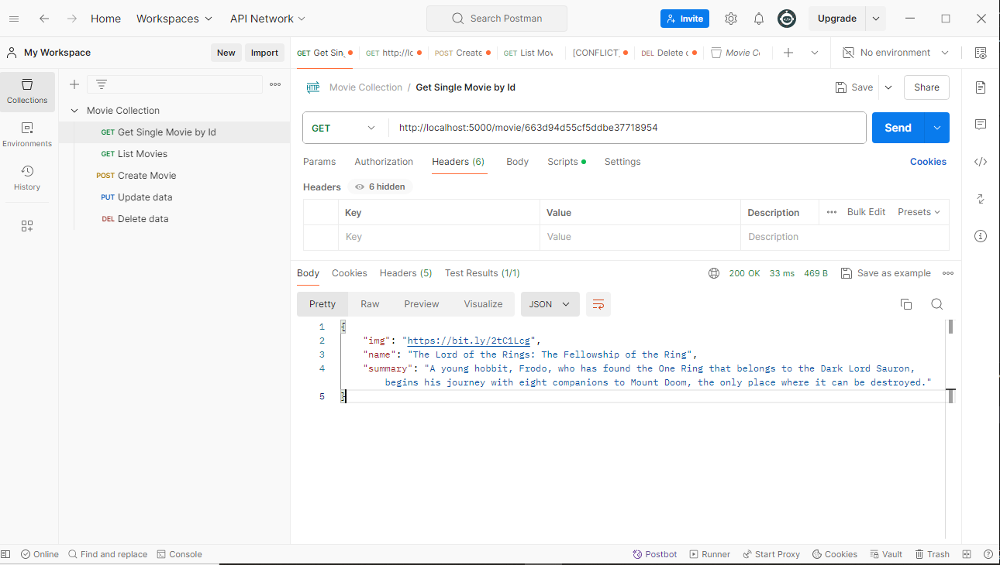
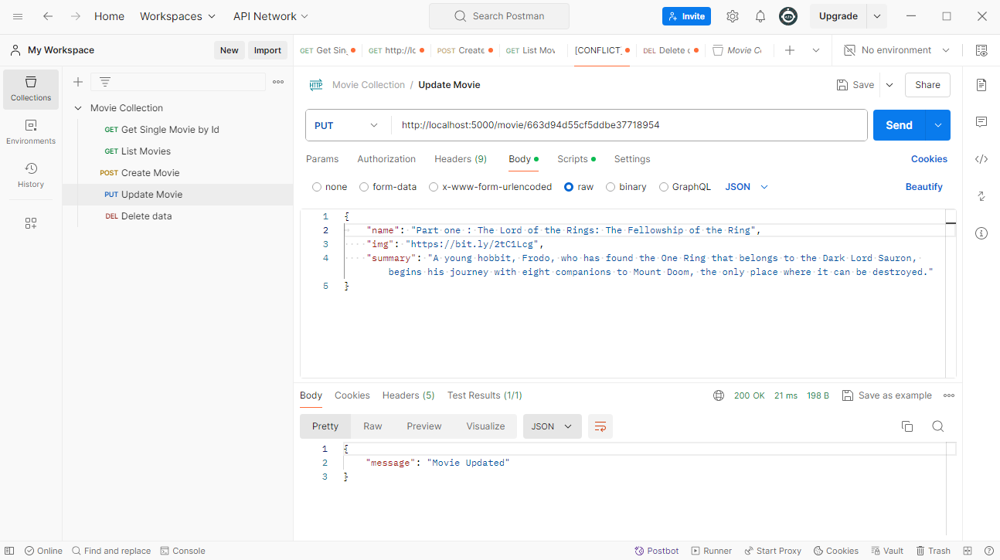
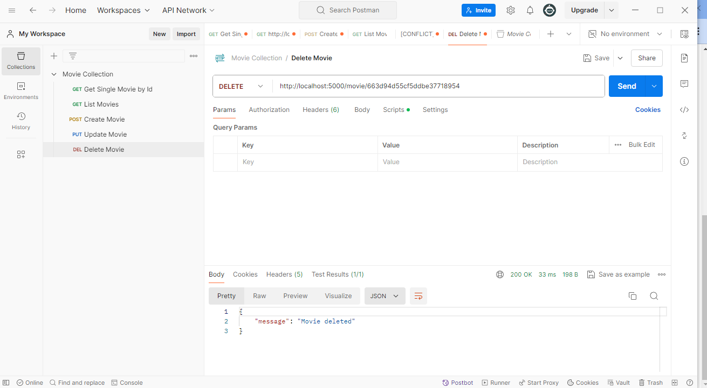

## Installation

Install with pip:

```
$ pip install -r requirements.txt
```
**Note:** requirements.txt is created with command pip freeze

### Run flask for develop
```
$ python app.py
```

### Database Connection
* Pymongo is a great library for MongoDB Connectivity
* import MongoClient from pymongo
* Fully Qualified path for mangodb - "mongodb://localhost:27017/"

### Commands for the CRUD Operations are:

* db.collection.insert_one()
* db.collection.find_one()
* db.collection.update_one()
* db.collection.delete_one()

### Rest API request for Postman Rest API:

* Create a new movie: POST http://localhost:5000/movie


* Get All movies: GET http://localhost:5000/movie


* Get Movie by Id: GET http://localhost:5000/movie/object_id


* Update a movie: PUT http://localhost:5000/movie/object_id



* Delete a Movie: DELETE http://localhost:5000/movie/object_id



### PostMan collection link